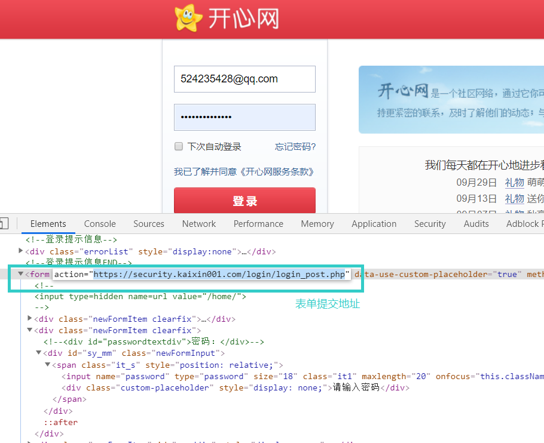
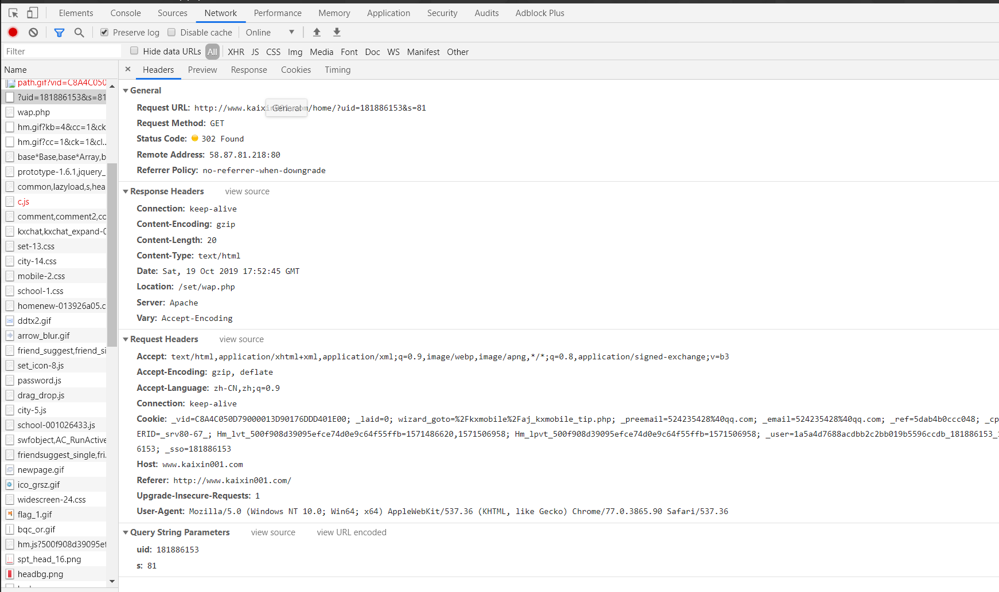

# HttpClient爬虫使用

&emsp;&emsp;Java本身提供了关于网络访问的包，在java.net中，然后它不够强大。于是Apache基金会发布了开源的http请求的包，即HttpClient，这个包提供了非常多的网络访问的功能。

## 一、HttpClient简单示例

### maven工程中导包

```xml
<dependencies>
    <dependency>
        <groupId>org.apache.httpcomponents</groupId>
        <artifactId>httpclient</artifactId>
        <version>4.5.3</version>
    </dependency>    
</dependencies>
```

### 一个简单示例

```java
   String url = "";    //请求路径

    //构造路径参数
    List<NameValuePair> nameValuePairList = Lists.newArrayList();
    nameValuePairList.add(new BasicNameValuePair("username","test"));
    nameValuePairList.add(new BasicNameValuePair("password","password"));

    //构造请求路径，并添加参数
    URI uri = new URIBuilder(url).addParameters(nameValuePairList).build();

    //构造Headers
    List<Header> headerList = Lists.newArrayList();
    headerList.add(new BasicHeader(HttpHeaders.ACCEPT_ENCODING,"gzip, deflate"));
    headerList.add(new BasicHeader(HttpHeaders.CONNECTION, "keep-alive"));

    //构造HttpClient
    HttpClient httpClient = HttpClients.custom().setDefaultHeaders(headerList).build();

    //构造HttpGet请求
    HttpUriRequest httpUriRequest = RequestBuilder.get().setUri(uri).build();

    //获取结果
    HttpResponse httpResponse = httpClient.execute(httpUriRequest);

    //获取返回结果中的实体
    HttpEntity entity = httpResponse.getEntity();

    //查看页面内容结果
    String rawHTMLContent = EntityUtils.toString(entity);

    System.out.println(rawHTMLContent);

    //关闭HttpEntity流
    EntityUtils.consume(entity);
```

&emsp;&emsp;爬虫的第一步需要构建一个客户端，即请求端，我们这里使用HttpClient作为我们的请求端，然后确定使用哪种方式请求什么网址，伪造请求头，携带参数等。再然后使用HttpResponse获取请求的地址对应的结果即可。最后取出HttpEntity转换一下就可以得到我们请求的网址对应的内容了。

## 二、HttpClient封装使用

&emsp;&emsp;Apache不仅开发了httpClient包，而且针对常用的一些网络爬虫技术做了封装，使之用来更为方便，commons-httpclient包是针对上述的封装开发便于客户端使用。

### maven工程中导包

```xml
  <dependencies>
    <dependency>
	    <groupId>apache-httpclient</groupId>
	    <artifactId>commons-httpclient</artifactId>
	    <version>3.1</version>
	</dependency>
  </dependencies>
```

### 1、实现get请求

```java
	HttpClient client = new HttpClient();
		//设置代理服务器和端口
//		client.getHostConfiguration().setProxy("proxyHost", "proxyPort");
		//使用get方法，如果服务器需要通过HTTPS链接,那只需要奖下面的url中的http换成https
		HttpMethod method = new GetMethod("http://www.bjkgjlu.com/64621hnb/328224105.html");
		//使用post方法
//		HttpMethod method = new PostMethod("http://www.bjkgjlu.com/64621hnb/328224105.html");
		client.executeMethod(method);
		//打印服务器返回的状态
		System.out.println(method.getStatusLine());
		//打印返回的信息
		System.out.println(method.getResponseBodyAsString());
		//释放链接
		method.releaseConnection();
```

### 2、处理重定向

 &emsp; &emsp; 在jsp/Servlet编程中的response.sendRedirect方法就是i使用HTTP协议中的重定向机制。它与JSP中的<jsp:forward>的区别在于后者是在服务器中实现页面的跳转，也就是说应用容器加载了索要跳转的页面内容并返回给客户端。而前者是返回一个状态码，这些状态码可能值见下表， 然后客户端读取需要跳转到的页面的URL并重新加载新的页面。就是这样一个过程，所以我们编程的时候就要通过HttpMethod.getStatusCode()方法判断返回值是否为下表中的某个值来判断是否需要跳转。如果已经确认需要进行页面跳转了，那么可以通过读取HTTP头中的location属性来获取新的地址。


```java
HttpClient client = new HttpClient();
		HttpMethod post = new PostMethod(url);
		
		client.executeMethod(post);
		System.out.println(post.getStatusLine().toString());
		post.releaseConnection();
		// 检查是否重定向
		int statuscode = post.getStatusCode();
		if ((statuscode == HttpStatus.SC_MOVED_TEMPORARILY) ||
            (statuscode == HttpStatus.SC_MOVED_PERMANENTLY) || 
				(statuscode ==HttpStatus.SC_SEE_OTHER) || 
            (statuscode == HttpStatus.SC_TEMPORARY_REDIRECT)) {
			// 读取新的 URL 地址 
			Header header=post.getResponseHeader("location");
			if (header!=null){
				String newuri=header.getValue();
				if((newuri==null)||(newuri.equals("")))
					newuri="/";
				//请求新的地址
				GetMethod redirect=new GetMethod(newuri);
				client.executeMethod(redirect);
		   		System.out.println("Redirect:"
                              +redirect.getStatusLine().toString());
				redirect.releaseConnection();
			}else 
				System.out.println("Invalid redirect");
		}
```

### 3、模仿登陆

#### 3.1 分析登陆请求表单

&emsp;&emsp;图为分析登陆表单得到的action地址，就是将登陆账号密码提交的地址，一般是提交到服务器验证成功之后，设置客户端cookie并产生重定向。



#### 3.2 分析登陆重定向

&emsp;&emsp;该网络请求为重定向后的请求，获取了uid等cookie得到服务器的认可。



#### 3.3 Java源码

```java
    public static String loginurl = "https://security.kaixin001.com/login/login_post.php";
    static Cookie[] cookies = {};

    static HttpClient httpClient = new HttpClient();
    
    static String email = "524235428@qq.com";//你的email
    static String psw = "123456";//你的密码
    // 消息发送的action
    String url = "http://www.kaixin001.com/home/";

    public static void getUrlContent()
            throws Exception {

        HttpClientParams httparams = new HttpClientParams();
        httparams.setSoTimeout(30000);
        httpClient.setParams(httparams);

        httpClient.getHostConfiguration().setHost("www.kaixin001.com", 80);

        httpClient.getParams().setParameter(
                HttpMethodParams.HTTP_CONTENT_CHARSET, "UTF-8");

        PostMethod login = new PostMethod(loginurl);
        login.addRequestHeader("Content-Type",
                "application/x-www-form-urlencoded; charset=UTF-8");

        NameValuePair Email = new NameValuePair("loginemail", email);// 邮箱
        NameValuePair password = new NameValuePair("password", psw);// 密码
        // NameValuePair code = new NameValuePair( "code"
        // ,"????");//有时候需要验证码，暂时未解决

        NameValuePair[] data = { Email, password };
        login.setRequestBody(data);

        httpClient.executeMethod(login);
        int statuscode = login.getStatusCode();
        System.out.println(statuscode + "-----------");
        String result = login.getResponseBodyAsString();
        System.out.println(result+"++++++++++++");

        cookies = httpClient.getState().getCookies();
        System.out.println("==========Cookies============");
        int i = 0;
        for (Cookie c : cookies) {
            System.out.println(++i + ":   " + c);
        }
        httpClient.getState().addCookies(cookies);

        // 当state为301或者302说明登陆页面跳转了，登陆成功了
        if ((statuscode == HttpStatus.SC_MOVED_TEMPORARILY)
                || (statuscode == HttpStatus.SC_MOVED_PERMANENTLY)
                || (statuscode == HttpStatus.SC_SEE_OTHER)
                || (statuscode == HttpStatus.SC_TEMPORARY_REDIRECT)) {
            // 读取新的 URL 地址
            Header header = login.getResponseHeader("location");
            // 释放连接
            login.releaseConnection();
            System.out.println("获取到跳转header>>>" + header);
            if (header != null) {
                String newuri = header.getValue();
                if ((newuri == null) || (newuri.equals("")))
                    newuri = "/";
                GetMethod redirect = new GetMethod(newuri);
                // ////////////
                redirect.setRequestHeader("Cookie", cookies.toString());
                httpClient.executeMethod(redirect);
                System.out.println("Redirect:"
                        + redirect.getStatusLine().toString());
                redirect.releaseConnection();

            } else
                System.out.println("Invalid redirect");
        } else {
            // 用户名和密码没有被提交，当登陆多次后需要验证码的时候会出现这种未提交情况
            System.out.println("用户没登陆");
            System.exit(1);
        }

    }
```

