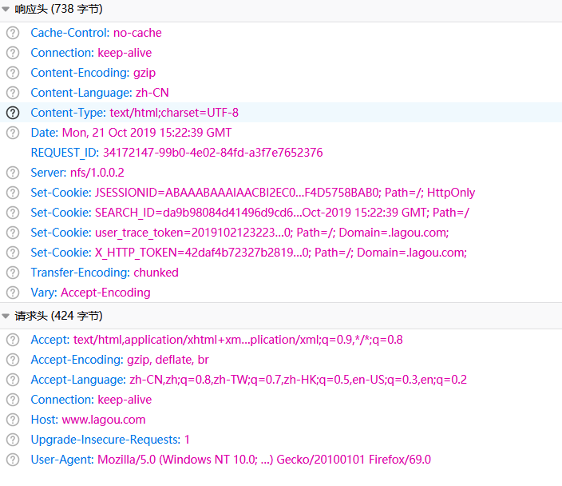
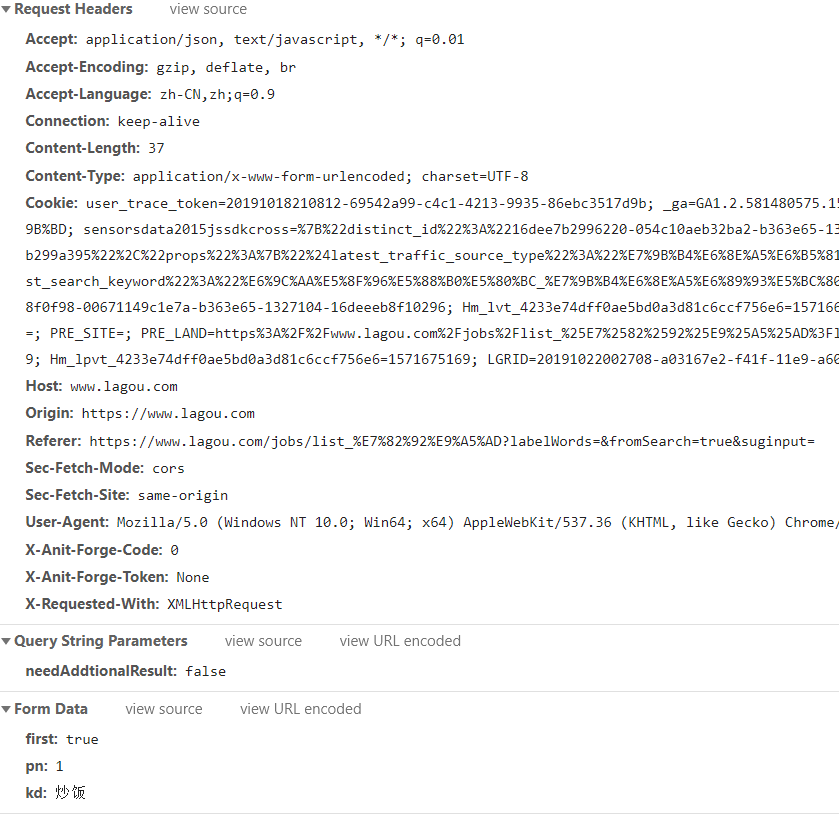

## 拉勾网爬取招聘信息

webMagic 0.7.0版本中移除了老的在request.extra中设置NameValuePair的方式，使用RequestBody 。

webMagic 0.7.0以下版本使用 Extra

    Request request = new Request("");
    request.setMethod(HttpConstant.Method.POST);
    NameValuePair[] nameValuePair = new NameValuePair[](){
    new BasicNameValuePair("id","100"),new BasicNameValuePair("tag","2")};
    request.setExtra("nameValuePair", nameValuePair);
    spider.addRequest(request);
webMagic 0.7.0以上版本使用 RequestBody

```java
Request request = new Request("");
request.setMethod(HttpConstant.Method.POST);
request.setRequestBody(HttpRequestBody.json("{'id':1}","utf-8"));
```

https://blog.csdn.net/just4you/article/details/61197834

https://www.jianshu.com/p/7c476c6c0b68



