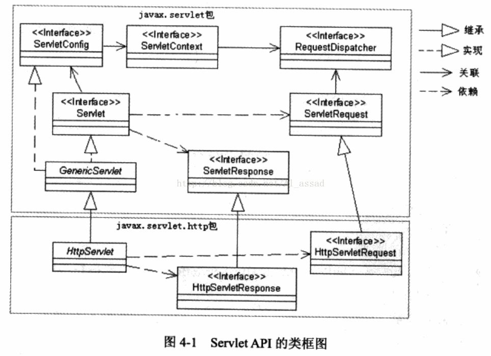
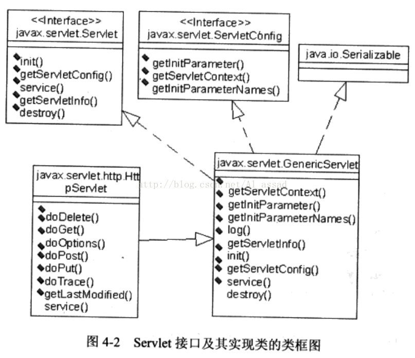

## Servlet基础

### 一、Servlet&Jsp简介

&emsp;&emsp;Servlet是使用Java程序所编写的一个Java类，通过Web容器的加载、初始化，收到容器的管理才得以成为一个Servlet。

&emsp;&emsp;容器是Java所编写的一个应用程序，负责与服务器沟通，管理Servlet所需的各种对象的与数据、Servlet生命周期。

&emsp;&emsp;Jsp让网页bi按记者可以直接在上面编写所熟悉的HTML，并可以根据需要添加为动态程序的成分，容器会将Jsp网页转译Servlet并加载到容器中进行管理，所有的Jsp最后都以Servlet的实例存在于容器之中。

### 二、Servlet主要API介绍

#### 2.1 Servlet主要类及关系

+ Servlet API 主要由2个Java包构成：javax.servlet 、java.servlet.http；
+ javax.servlet 包定义了与 Servlet 接口相关的通用接口和类
+ java.servlet.http 包主要定义了与HTTP协议相关的 HttpServlet类、HttpServletRequest类、HttpServletResponse类；



#### 2.2 Servlet主要方法及作用

|                           方法                            | 作用                                                         |
| :-------------------------------------------------------: | :----------------------------------------------------------- |
| void **service**(ServletRequest req, ServletResponse res) | 负责响应客户的请求，为客户提供相应服务                       |
|                    void **destroy**()                     | 负责释放 Servlet 对象占用的资源，但Servlet对象结束生命周期时，会调用该方法 |
|           ServletConfig **getServletConfig**()            | 返回 ServeltConfig 对象，包含Servlet的初始化信息             |
|                String **getServletInfo**()                | 返回包含Servlet创建者、版本信息等的字符串                    |
|            void **init**(ServletConfig config)            | 负责初始化Servlet对象，容器在创建Servlet对象后，会调用该方法 |

&emsp;&emsp;Servlet API 中，javax.servlet.GenericServlet 抽象类 和 其子类 java.servlet.http.HttpServlet 实现了 Servlet 接口，用户开发自己的Servlet类时，一般如果没有特殊需求，可以选择直接通过继承这2个类来实现；

#### 2.3 **GenericServlet 抽象类**

&emsp;&emsp;对于GenericServlet类的 init() 方法，如果希望当前 Servlet 类对象与 ServeltConfig 对象关联，在初始化方法中应调用 super.init(config)方法，如下：

```java
public void init(ServletConfig config){
    super.init(config);
    ......
}
```

&emsp;&emsp;实现Servlet接口的类是GenericServlet，它还实现了ServeltConfig接口，并将容器调用init()方法是所传入的ServletConfig实例封装起来，而将Service()方法直接标示为abstract没有任何实现。



#### 2.4 HttpServlet抽象类

&emsp;&emsp;GenericServlet没有规范任何有关HTTP的方法，而是由它的HttpServlet来定义的。在最初定义Servlet时并不限定它只能用于HTTP，所以并没有将HTTP相关服务流程定义在GenericServlet之中，而是定义在HttpServlet的service()之中。

|                             方法                             |              作用               |
| :----------------------------------------------------------: | :-----------------------------: |
| **doGet**（HttpServletRequest req, HttpServletResponse res)  |          处理 GET 请求          |
| **doPost**（HttpServletRequest req, HttpServletResponse res） |         处理 POST 请求          |
| **doPut**（HttpServletRequest req, HttpServletResponse res） |  处理 PUT 请求（主要用于FTP）   |
| **doDelete**（HttpServletRequest req, HttpServletResponse res） | 处理 DELETE 请求（主要用于FTP） |

HttpServlet 的在处理请求的过程中，会首先调用service()方法，service方法()在判断请求类型之后，根据请求类型调用相应的doGet，doPost，doPut，doDelete等方法，如果要维持以上的调用特性，在继承HttpServlet重写service()方法时，要首先调用super.service()方法，如下：

```java
public void service(HttpServletRequest req,HttpServletResponse res){
    super.service(req,res);
}
```

