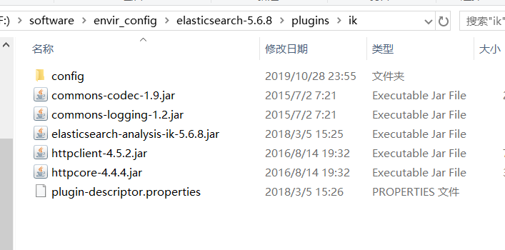

# ElasticSearch安装及使用

## 一、ElasticSearch简介

&emsp;&emsp;ElasticSearch是一个基于[Lucene](https://baike.baidu.com/item/Lucene/6753302)的搜索服务器。它提供了一个分布式多用户能力的全文搜索引擎，基于RESTful web接口。Elasticsearch是用Java语言开发的，并作为Apache许可条款下的开放源码发布，是一种流行的企业级搜索引擎。

## 二、ElasticSearch安装

&emsp;&emsp;ElasticSearch的项目版本更新很快，我使用的是5.6.8版[ElasticSearch下载](https://www.elastic.co/cn/downloads/past-releases#elasticsearch)，下载完毕之后在config/elasticsearch.yml种添加一下命令，保存之后打开bin/elasticsearch.bat即可打开。然后再浏览器输入地址`http://localhost:9200/`,能够正常打开即代表安装成功。

```shell
http.cors.enabled:true
http.cors.allow-origin:"*"
network.host:127.0.0.1
```
&emsp;&emsp;安装完之后暂时还不能实现分词效果，还需要安装一个分词插件，[IK分词器下载](https://github.com/medcl/elasticsearch-analysis-ik/releases)，里面的版本最好与项目版本一致，下载完之后解压放在项目下的plugin下并重命名ik;如下入所示。



&emsp;&emsp;重启之后在浏览器输入链接:`http://localhost:9200/_analyze?analyzer=ik_smart&pretty=true&text=我是程序员`，即可得到以下效果实现分词作用。

```json
{
  "tokens" : [
    {
      "token" : "我",
      "start_offset" : 0,
      "end_offset" : 1,
      "type" : "CN_CHAR",
      "position" : 0
    },
    {
      "token" : "是",
      "start_offset" : 1,
      "end_offset" : 2,
      "type" : "CN_CHAR",
      "position" : 1
    },
    {
      "token" : "程序员",
      "start_offset" : 2,
      "end_offset" : 5,
      "type" : "CN_WORD",
      "position" : 2
    }
  ]
}
```

**ES的图形化界面安装**

&emsp;&emsp;为了便于管理ES，使用head插件，这是最初级的管理工具，在浏览器中显示ES集群，索引等信息。[ElasticSearch-head下载地址](https://codeload.github.com/mobz/elasticsearch-head/zip/master)

打开DOS窗口并切换目录elasticsearch-head执行：

```
cnpm install -g grunt-cli
cnpm install
grunt server#启动该服务
```

&emsp;&emsp;若服务启动成功，则在浏览器输入`localhost:9100`即可显示下图


## 三、安装成本地windows服务

1、打开DOS窗口，切换至elasticsearch/bin目录执行

```shell
#安装elasticsearch服务
elasticsearch-service.bat install
#启动elasticsearch服务
elasticsearch-service.bat start
```

&emsp;&emsp;每个版本的service名称不同，如果有错误不能执行，建议查看一下bin目录下的带service.bat的文件，使用文件名在进行安装

2、检验是否成功开启

&emsp;&emsp;第一种方法：浏览器窗口打开链接`http://localhost:9200/`,如果有信息显示则代表成功

&emsp;&emsp;第二种方法：Win+R输入**services.msc**打开windows服务界面，找到elasticsearch就代表成功


